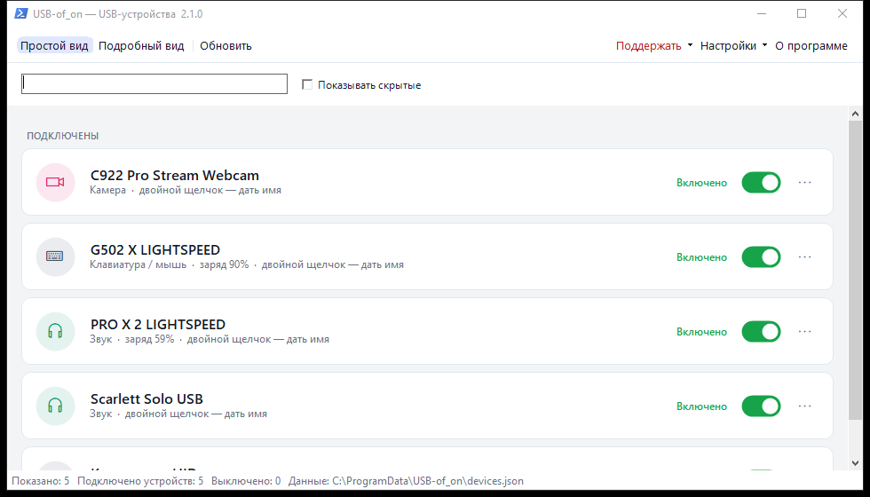
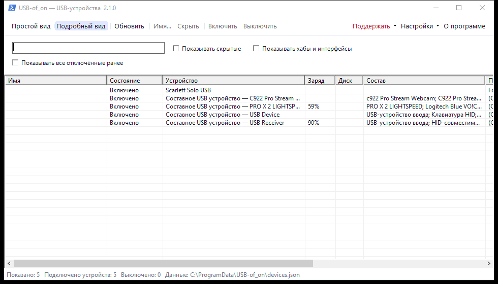
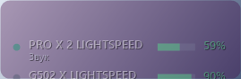
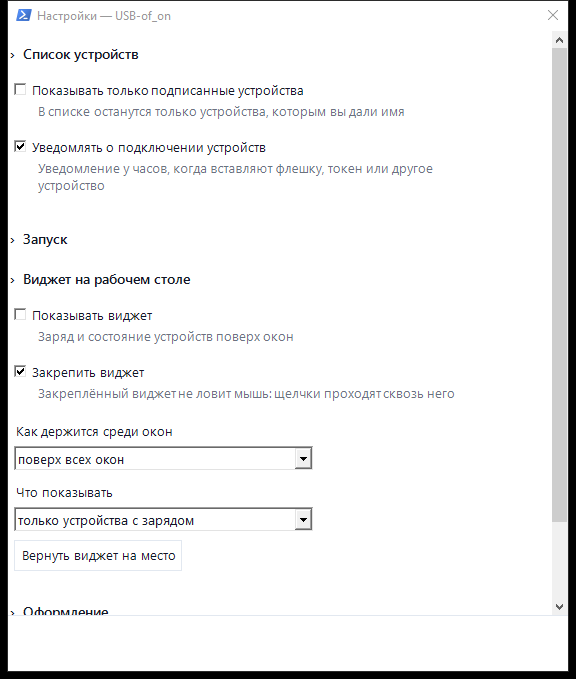
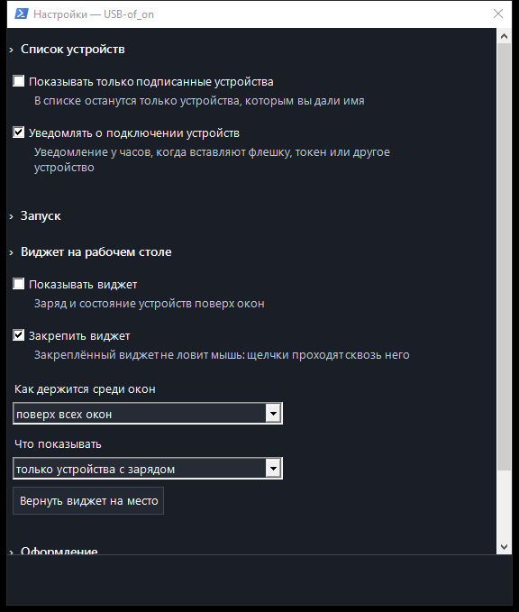
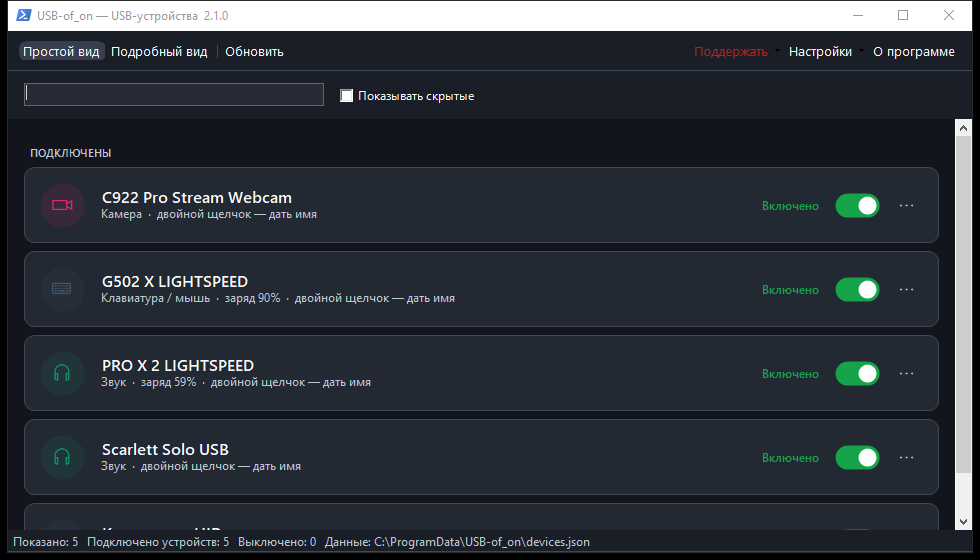
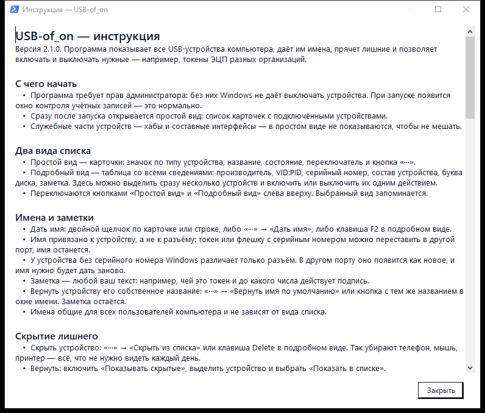

<div align="center">


# USB-of_on

**USB-устройства Windows под контролем**

Имена для токенов ЭЦП и флешек, скрытие лишнего, включение и выключение
устройств, заряд беспроводных и виджет на рабочем столе.

[](https://lvl.su/)
[](https://t.me/kotamarine)
[](https://t.me/aveharrisan)
[](https://discord.com/invite/XYBvdvfv8t)

[](https://github.com/AveHarrisan/USB-of_on/releases/latest/download/USB-of_on-Setup.exe)

[](https://github.com/AveHarrisan/USB-of_on/releases)
[](https://github.com/AveHarrisan/USB-of_on/releases/latest)
[](https://github.com/AveHarrisan/USB-of_on/releases)



</div>

---

## Зачем

В компьютер вставлено пять токенов УКЭП разных организаций — и все они в системе
выглядят одинаково: «Rutoken ECP». USB-of_on даёт каждому имя, позволяет держать
включённым только нужный, а телефон, мышь и прочее лишнее убрать из списка.
Заодно показывает заряд беспроводных мышей, клавиатур и гарнитур.

**Установка.** Скачайте [USB-of_on-Setup.exe](https://github.com/AveHarrisan/USB-of_on/releases/latest/download/USB-of_on-Setup.exe)
и запустите. Нужны Windows 10 или 11, ничего доустанавливать не требуется.
Программа просит права администратора: без них Windows не даёт выключать устройства.

---

## Возможности

<details>
<summary><b>Список устройств: два вида</b></summary>

**Простой вид** — карточки: значок по типу устройства, понятное название,
состояние, заряд, переключатель и меню «···».


**Подробный вид** — таблица со всеми сведениями: производитель, VID:PID,
серийный номер, состав устройства, буква диска, заметка. Здесь можно выделить
сразу несколько устройств и включить или выключить их одним действием.



Список обновляется сам, когда устройство вставляют или вынимают. Поиск идёт по
всем колонкам. Выбранный вид запоминается.

</details>

<details>
<summary><b>Имена, заметки и скрытие</b></summary>

- **Дать имя:** двойной щелчок по карточке, «···» → «Дать имя» или клавиша F2.
- **Имя привязано к устройству, а не к разъёму:** токен или флешку с серийным
  номером можно переставить в другой порт, имя останется.
- **Вернуть исходное название:** «···» → «Вернуть имя по умолчанию» или кнопка
  в окне имени. Заметка при этом сохраняется.
- **Заметка** — любой ваш текст: чей это токен, до какого числа действует подпись.
- **Скрыть лишнее:** Del или «···» → «Скрыть из списка». Вернуть — галочка
  «Показывать скрытые».
- **Только подписанные:** в настройках можно оставить в списке лишь устройства
  с именем.

Имена лежат в `C:\ProgramData\USB-of_on\devices.json` и общие для всех
пользователей компьютера.

</details>

<details>
<summary><b>Включение и выключение</b></summary>

Переключатель в карточке или кнопки в таблице. Это то же, что «Отключить
устройство» в Диспетчере устройств: устройство остаётся в разъёме, но Windows
его не видит — токен пропадает из КриптоПро, флешка из Проводника. Состояние
сохраняется после перезагрузки.

- Выключается **устройство, а не питание разъёма**: обычные USB-контроллеры
  не позволяют программно обесточить порт.
- **Хабы выключать нельзя** — за ними могут быть клавиатура и мышь.
- Перед выключением **клавиатуры или мыши** будет предупреждение.
- Если устройство занято — открыт файл с флешки, КриптоПро держит токен, —
  Windows применит выключение после перезагрузки, и программа об этом скажет.

</details>

<details>
<summary><b>Заряд беспроводных устройств</b></summary>

Заряд берётся только из источников, которые **не будят устройства**:

| Источник | Что даёт |
| --- | --- |
| Данные Windows | Bluetooth-мыши и клавиатуры, контроллеры, перья — всё, о чём система уже знает |
| Logitech G HUB | Мыши, клавиатуры и гарнитуры Logitech, пока G HUB запущен |
| Журнал Razer Synapse | Устройства Razer, пока Synapse запущен |

Отдельно есть настройка **«Спрашивать заряд у самих устройств Logitech»**,
по умолчанию выключенная: программа коротко опрашивает приёмник по протоколу
HID++ и узнаёт заряд и точное название мыши или клавиатуры даже без G HUB.
Минус честный — спящее устройство от такого запроса просыпается.

Устройство за приёмником подписывается своим названием: «G502 X LIGHTSPEED»
вместо «USB Receiver». Пока окно спрятано в трей и виджет выключен, заряд
не запрашивается вовсе.

</details>

<details>
<summary><b>Виджет на рабочем столе</b></summary>



- **Что показывать:** только устройства с зарядом, они же с подписанными,
  все подключённые или только подписанные.
- **Как держится среди окон:** поверх всех окон, как обычное окно или на
  рабочем столе — под всеми окнами.
- **Закрепление:** закреплённый виджет не ловит мышь, щелчки проходят сквозь
  него, и строка «перетащите мышью» исчезает.
- **Оформление:** тема из Windows или своя, свой цвет подложки палитрой либо
  кодом вида `#1E2A3A`, плотность подложки от плотной до полностью прозрачной,
  непрозрачность.
- Перетаскивается мышью, место запоминается. Ширина подбирается по длине имён.

</details>

<details>
<summary><b>Работа в трее и автозапуск</b></summary>

- **Крестик прячет окно**, программа продолжает следить за устройствами.
- **Закрыть** можно правой кнопкой по значку у часов → «Закрыть приложение»
  и подтверждение.
- **Повторный запуск** не создаёт вторую копию, а открывает окно работающей.
- **Уведомление о подключении:** когда вставляют устройство, у часов появляется
  сообщение; щелчок открывает программу и подсвечивает это устройство.
- **Автозапуск при входе в Windows** — задачей Планировщика, без окна контроля
  учётных записей. Можно запускаться сразу в трей.

</details>

<details>
<summary><b>Настройки и тёмная тема</b></summary>

Окно «Настройки → Все настройки»: разделы сворачиваются, изменения применяются
сразу.

<table>
<tr>
<td></td>
<td></td>
</tr>
</table>

Тема приложения берётся из Windows, её же можно задать вручную — тёмную или
светлую. Перекрашиваются список, карточки, таблица, настройки, инструкция,
«О программе» и все меню.



</details>

<details>
<summary><b>Инструкция и отчёт для разбора</b></summary>

Внутри программы есть подробная инструкция: «О программе» → «Инструкция».



Если что-то показано неверно, «Настройки → Собрать отчёт для разбора» сохраняет
текстовый файл: найденные устройства с их родителями и признаками, ответы
Windows, G HUB и Synapse, список HID-коллекций, настройки программы и пометка,
откуда взято каждое значение заряда. Файл можно прочитать перед отправкой —
личных данных в нём нет, только сведения об устройствах.

</details>

<details>
<summary><b>Обновления и что программа делает в сети</b></summary>

Программа проверяет новые версии при запуске и раз в шесть часов. Когда выходит
новая, сверху появляется полоса со ссылкой «Что нового» и кнопкой «Обновить»:
установщик скачивается и ставится сам, программа закрывается и открывается
снова. Имена и настройки сохраняются.

Обращения в сеть только эти:

- **GitHub** — сведения о последней версии (через API, а при его недоступности
  через файл с номером версии в репозитории) и скачивание установщика.
- **G HUB** — заряд устройств по локальному адресу вашего же компьютера,
  в интернет это не выходит.

Ни статистики, ни идентификаторов, ни списка устройств никуда не отправляется.

</details>

---

## Поддержать и найти меня

<div align="center">
<table>
<tr>
<td align="center" width="120">
<a href="https://boosty.to/aveharrisan">
<br>
<b>Boosty</b>
</a><br>
<sub>разово или подпиской</sub>
</td>
<td align="center" width="120">
<a href="https://www.donationalerts.com/r/aveharrisan">
<br>
<b>DonationAlerts</b>
</a><br>
<sub>разовый донат</sub>
</td>
<td align="center" width="120">
<a href="https://lvl.su/">
<br>
<b>lvl.su</b>
</a><br>
<sub>гайды и вики</sub>
</td>
<td align="center" width="120">
<a href="https://t.me/kotamarine">
<br>
<b>Котамарин</b>
</a><br>
<sub>канал про игры</sub>
</td>
<td align="center" width="120">
<a href="https://discord.com/invite/XYBvdvfv8t">
<br>
<b>Discord</b>
</a><br>
<sub>вопросы и ошибки</sub>
</td>
<td align="center" width="120">
<a href="https://t.me/aveharrisan">
<br>
<b>AveHarrisan</b>
</a><br>
<sub>телеграм автора</sub>
</td>
</tr>
</table>
</div>

---

## Для разработчика

<details>
<summary><b>Как это устроено</b></summary>

C# и WinForms на .NET Framework 4.8 — один небольшой exe без зависимостей.
Список устройств берётся из SetupAPI и Configuration Manager Windows, буквы
дисков — из WMI, выключение — `DIF_PROPERTYCHANGE`, как в Диспетчере устройств.
Заряд: свойство Bluetooth у Windows, локальный канал G HUB, журнал Synapse
и по желанию протокол HID++. Виджет рисуется слоем с попиксельной прозрачностью.
Установщик — Inno Setup.

```
src/USBofon/  код программы
installer/    сценарий установщика и картинки мастера
assets/       иконка и картинки ссылок
scripts/      значки загрузок для описания
docs/         скриншоты и значки
```

</details>

<details>
<summary><b>Собрать и выпустить</b></summary>

```
dotnet build src/USBofon/USBofon.csproj -c Release
"C:\Program Files (x86)\Inno Setup 6\ISCC.exe" /DAppVersion=2.1.0 installer\USB-of_on.iss
```

Программа — `src/USBofon/bin/Release/net48/USB-of_on.exe`,
установщик — `dist/USB-of_on-Setup.exe`.

Выпуск новой версии: поднять `<Version>` в `USBofon.csproj`, добавить раздел
в [CHANGELOG.md](CHANGELOG.md) и запушить в `main` — GitHub Actions соберёт
всё сам и выложит релиз.

</details>

Нашли ошибку или хотите функцию — [заведите задачу](https://github.com/AveHarrisan/USB-of_on/issues)
или напишите в [Discord](https://discord.com/invite/XYBvdvfv8t).
