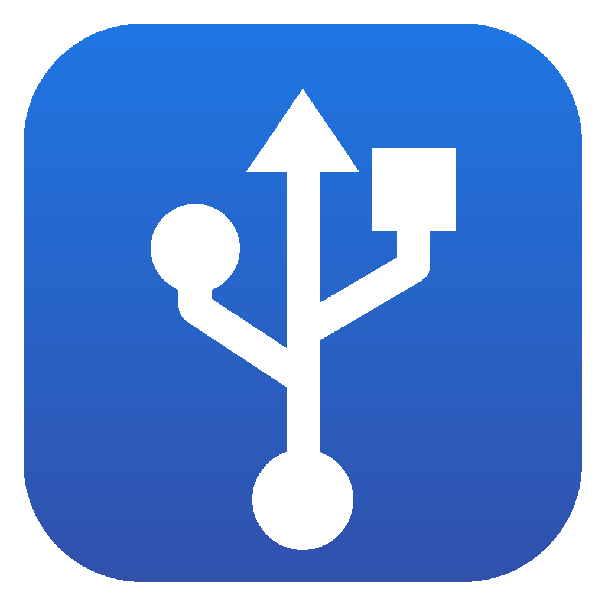
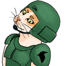
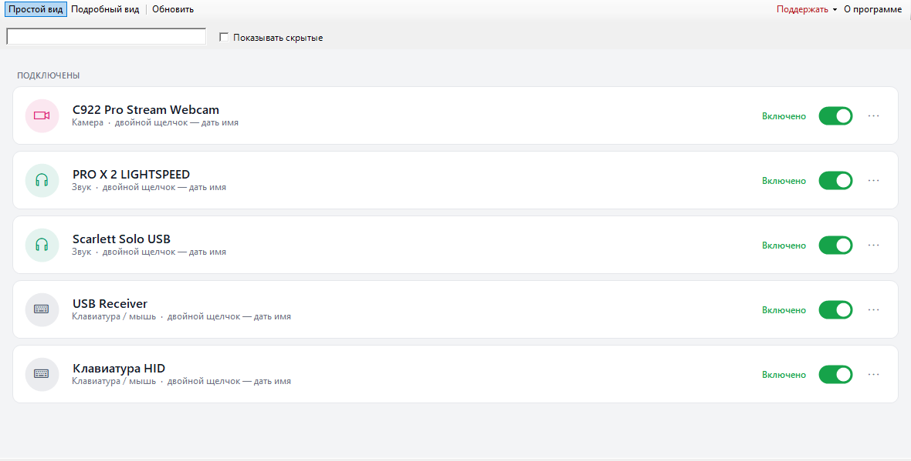
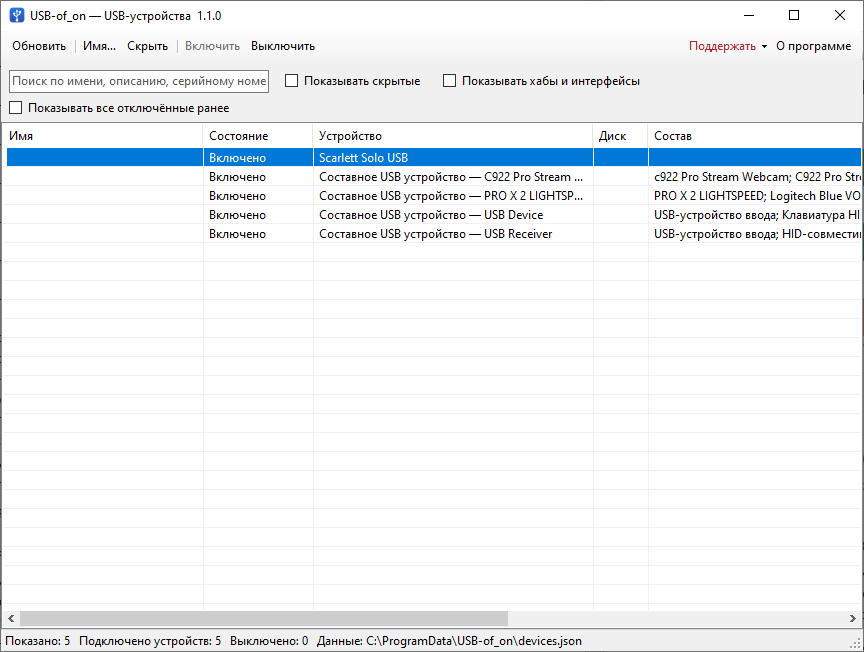
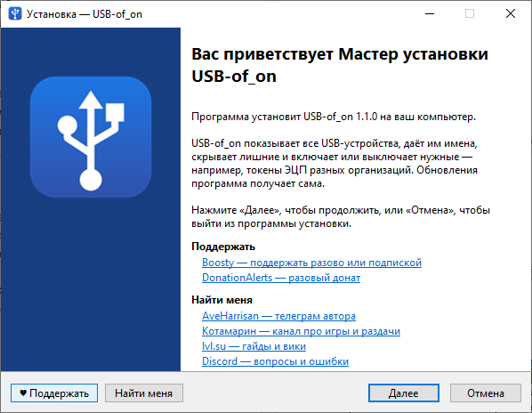

<div align="center">



# USB-of_on

**USB-устройства Windows под контролем**

Имена для токенов ЭЦП и флешек, скрытие лишнего, включение и выключение
устройств одной кнопкой.

[](https://lvl.su/)
[](https://t.me/kotamarine)
[](https://t.me/aveharrisan)
[](https://discord.com/invite/XYBvdvfv8t)

### Скачать

[](https://github.com/AveHarrisan/USB-of_on/releases/latest/download/USB-of_on-Setup.exe)

[](https://github.com/AveHarrisan/USB-of_on/releases)
[](https://github.com/AveHarrisan/USB-of_on/releases/latest)
[](https://github.com/AveHarrisan/USB-of_on/releases)

### Поддержать и найти меня

Проект делается в свободное время. Если он вам пригодился:

<table>
<tr>
<td align="center" width="120">
<a href="https://boosty.to/aveharrisan">
<br>
<b>Boosty</b>
</a><br>
<sub>разово или подпиской</sub>
</td>
<td align="center" width="120">
<a href="https://www.donationalerts.com/r/aveharrisan">
<br>
<b>DonationAlerts</b>
</a><br>
<sub>разовый донат<br>без подписки</sub>
</td>
<td align="center" width="120">
<a href="https://lvl.su/">
<br>
<b>lvl.su</b>
</a><br>
<sub>гайды и вики</sub>
</td>
<td align="center" width="120">
<a href="https://t.me/kotamarine">
<br>
<b>Котамарин</b>
</a><br>
<sub>канал про игры<br>и раздачи</sub>
</td>
<td align="center" width="120">
<a href="https://discord.com/invite/XYBvdvfv8t">
<br>
<b>Discord</b>
</a><br>
<sub>вопросы и ошибки</sub>
</td>
<td align="center" width="120">
<a href="https://t.me/aveharrisan">
<br>
<b>AveHarrisan</b>
</a><br>
<sub>телеграм<br>автора</sub>
</td>
</tr>
</table>

</div>

---

## Зачем

В компьютер вставлено пять токенов УКЭП разных организаций — и все они
в системе выглядят одинаково: «Rutoken ECP». USB-of_on даёт каждому имя,
позволяет держать включённым только нужный, а телефон, мышь и прочее лишнее
убрать из списка.



Два вида: **простой** — карточки с переключателем, как на картинке выше, и
**подробный** — таблица со всеми сведениями: VID:PID, серийный номер,
производитель, состав устройства.

<details>
<summary>Подробный вид</summary>



</details>

## Установка

1. Скачайте **[USB-of_on-Setup.exe](https://github.com/AveHarrisan/USB-of_on/releases/latest/download/USB-of_on-Setup.exe)**
2. Запустите и нажмите «Далее»
3. Программа появится в «Пуске» и, если отметить, на рабочем столе

Нужны Windows 10 или 11 — .NET Framework 4.8 в них уже есть. Программа
запрашивает права администратора: без них Windows не даёт выключать устройства.



### Обновления

Программа проверяет новые версии сама — при запуске и раз в шесть часов.
Когда выходит новая, сверху появляется полоса «Вышла версия…» со ссылкой
«Что нового» и кнопкой **«Обновить»**: установщик скачивается, программа
закрывается, ставится новая версия и открывается снова. Скачанный файл
удаляется, имена и скрытые устройства сохраняются.

Проверить вручную — **О программе → Проверить обновления**.

<details>
<summary>Удалить программу</summary>

Через «Параметры → Приложения» или «Панель управления → Программы».
Установщик спросит, удалить ли заодно сохранённые имена устройств: если
оставить, после повторной установки они вернутся.

</details>

---

## Возможности

<details open>
<summary>Простой вид</summary>

Каждое устройство — карточка: значок по типу (токен, флешка, телефон,
камера, звук, клавиатура), понятное название без служебных слов Windows,
состояние и переключатель. Щелчок по переключателю включает или
выключает устройство, двойной щелчок по карточке — дать имя, «⋯» или
правая кнопка — меню: переименовать, скрыть, копировать сведения.

Сверху — подключённые, ниже — вынутые, которым вы дали имя.

</details>

<details>
<summary>Подробный вид</summary>

Все USB-устройства: подключённые сейчас и вынутые, которым вы дали имя.
Для каждого видно:

| Колонка | Что в ней |
| --- | --- |
| Имя | ваше название — например, организация |
| Состояние | включено, выключено, не подключено или ошибка |
| Устройство | название из Windows и то, что сообщает само устройство |
| Диск | буква диска у флешек |
| Состав | что внутри: считыватель, диск, клавиатура… |
| Производитель, VID:PID, серийный номер | чтобы отличить одинаковые устройства |
| Заметка | любой ваш текст |

Список обновляется сам, когда устройство вставляют или вынимают. Поиск
ищет по всем колонкам.

</details>

<details open>
<summary>Имена и скрытие</summary>

- **Имя и заметка** — двойной щелчок, F2 или кнопка «Имя…». Имя привязано
  к самому устройству: у токенов и флешек с серийным номером оно не
  теряется при перестановке в другой разъём.
- **Скрыть** — Del или кнопка «Скрыть». Вернуть: «Показывать скрытые» →
  выделить → «Показать».
- Хабы и служебные части составных устройств скрыты по умолчанию —
  включаются галочкой.

Имена хранятся в `C:\ProgramData\USB-of_on\devices.json`, общем для всех
пользователей компьютера.

</details>

<details open>
<summary>Заряд и виджет</summary>

Заряд читается у Bluetooth-устройств (то же число, что показывают «Параметры»
Windows) и у HID-устройств со стандартным отчётом о батарее. Мыши и клавиатуры Logitech, в том числе через приёмник Unifying или
Lightspeed, опрашиваются по их протоколу HID++. Сами устройства программа не опрашивает: такой запрос будит уснувшую мышь
или клавиатуру. Заряд берётся только из источников, которые ничего не будят:

- **данных Windows** — всё, о чём система уже знает: Bluetooth-мыши
  и клавиатуры, контроллеры, перья;
- **G HUB** — устройства Logitech, пока он запущен;
- **журнала Synapse** — устройства Razer, пока он запущен.

Отдельно есть настройка «Спрашивать заряд у самих устройств Logitech»,
по умолчанию выключенная: программа коротко опрашивает приёмник по протоколу
HID++ и показывает заряд мышей и клавиатур даже без G HUB. Минус — спящее
устройство от такого запроса просыпается, поэтому решение за вами.

У SteelSeries заряда в их локальном канале нет, у Corsair он доступен только
через отдельную библиотеку их SDK. Устройства, о которых не знает ни Windows,
ни программа производителя, заряд не показывают. Пока окно спрятано в трей и виджет выключен,
не запрашивается и это. Устройства
других производителей с фирменным протоколом заряд не отдают — у них поле
остаётся пустым.

Виджет на рабочем столе показывает заряд и состояние поверх окон:
включается в «Настройках» или в меню трея, перетаскивается мышью, место
запоминается. Закреплённый виджет не ловит мышь — щелчки проходят сквозь
него, случайно ничего не нажать. Виджет может держаться поверх всех окон, вести себя как обычное окно или
лежать на рабочем столе — под всеми окнами. Плотность подложки настраивается от плотной до полностью прозрачной, когда
остаётся только текст поверх обоев; там же — непрозрачность и состав списка.

Тема приложения — тёмная или светлая — берётся из Windows и переключается
в настройках. Всё остальное — в окне «Настройки → Все настройки»: список, автозапуск,
виджет и источники заряда.

</details>

<details open>
<summary>Включение и выключение</summary>

То же, что «Отключить устройство» в Диспетчере устройств: устройство
остаётся в разъёме, но Windows с ним не работает. Состояние сохраняется
после перезагрузки. Можно выделить несколько устройств сразу.

- Хабы выключать нельзя — за ними могут быть клавиатура и мышь.
- Перед выключением клавиатуры или мыши будет предупреждение.
- Если устройство занято (открыт файл с флешки, КриптоПро держит токен),
  Windows может применить выключение только после перезагрузки —
  программа об этом скажет.

</details>

### Если что-то показано неверно

«Настройки → Собрать отчёт для разбора» сохраняет текстовый файл: найденные
устройства, ответы Windows, G HUB и журнала Synapse и пометка, откуда взято
каждое значение заряда. Файл можно прочитать перед отправкой — личных данных
в нём нет, только названия и серийные номера устройств.

### Что программа делает в сети

- **Проверяет обновления** — запрашивает у GitHub сведения о последней версии,
  и по кнопке «Обновить» скачивает оттуда установщик.
- **Спрашивает заряд у G HUB** по локальному адресу компьютера; в интернет
  это не выходит.
- Ничего больше никуда не отправляется: ни статистики, ни идентификаторов,
  ни списка устройств.

### Ограничения

- Выключается устройство, а не питание разъёма: обычные USB-контроллеры
  не дают программно обесточить порт. Для токенов и флешек результат
  тот же — система их не видит.
- Устройство без серийного номера Windows различает по разъёму: в другом
  порту оно появится как новое, имя придётся дать заново.

---

## Как это устроено

C# и WinForms на .NET Framework 4.8 — один небольшой exe без зависимостей.
Список берётся из SetupAPI и Configuration Manager Windows, буквы дисков —
из WMI, выключение — `DIF_PROPERTYCHANGE`, как в Диспетчере устройств.
Установщик — Inno Setup.

<details>
<summary>Выпуск новой версии</summary>

1. Поднять `<Version>` в `src/USBofon/USBofon.csproj`
2. Добавить раздел с этой версией в [CHANGELOG.md](CHANGELOG.md)
3. Запушить в `main`

GitHub Actions соберёт программу и установщик и выложит релиз `vX.Y.Z`
с `USB-of_on-Setup.exe`, описание возьмёт из CHANGELOG. Если релиз с такой
версией уже есть — просто проверит, что всё собирается. Уже установленные
программы увидят релиз и предложат обновиться.

</details>

<details>
<summary>Собрать самому</summary>

```
dotnet build src/USBofon/USBofon.csproj -c Release
"C:\Program Files (x86)\Inno Setup 6\ISCC.exe" /DAppVersion=1.1.0 installer\USB-of_on.iss
```

Программа — `src/USBofon/bin/Release/net48/USB-of_on.exe`,
установщик — `dist/USB-of_on-Setup.exe`.

</details>

<details>
<summary>Структура</summary>

```
src/USBofon/  код программы
installer/    сценарий установщика и картинки мастера
assets/       иконка и картинки ссылок
scripts/      значки загрузок для описания
docs/         картинки и значки описания
```

</details>

---

## Вопросы и общение

Сервер в Discord — **[discord.com/invite/XYBvdvfv8t](https://discord.com/invite/XYBvdvfv8t)**.
Нашли ошибку — [заведите задачу](https://github.com/AveHarrisan/USB-of_on/issues) или напишите там.

Где меня ещё найти:

- **[lvl.su](https://lvl.su/)** — сайт: гайды и вики по играм
- **[Котамарин](https://t.me/kotamarine)** — телеграм-канал про игры
- **[AveHarrisan](https://t.me/aveharrisan)** — личный телеграм

Те же ссылки есть в программе — «О программе» — и в окне установщика.

## Поддержать

Ссылки — [в начале страницы](#поддержать-и-найти-меня): **Boosty** для
разовой или регулярной поддержки и **DonationAlerts** для разового доната.
